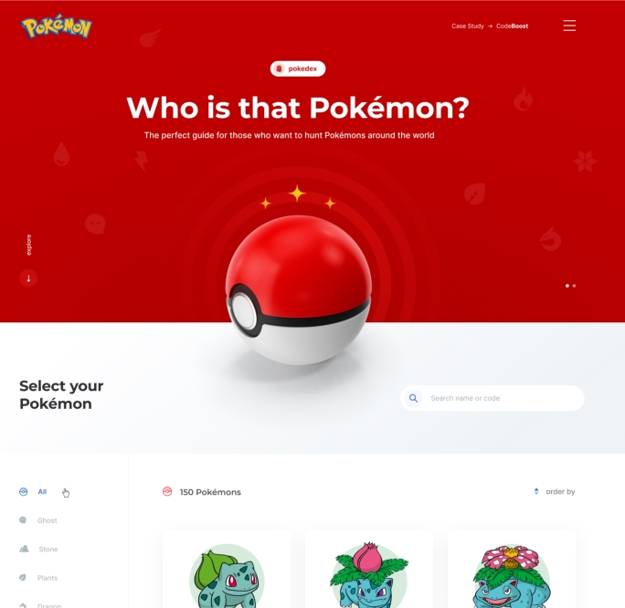

 
 

<h1>Pokedex Api</h1>

 
 

  

 

> Status do Projeto: Em finalização :warning:

 

### Tópicos

:small_blue_diamond: [Descrição do projeto](#descrição-do-projeto-page_with_curl)

## Descrição do projeto :page_with_curl: 
