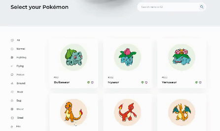

<h1>Pokedex Api</h1>

</br>
<div align="center">
  
</div>
<br>

> Status do Projeto: Em finalização :warning:

<br>

### Tópicos

:small_blue_diamond: [Descrição do projeto](#descrição-do-projeto-page_with_curl)

:small_blue_diamond: [Funcionalidades](#funcionalidades-heavy_check_mark)

:small_blue_diamond: [Funcionalidades em aberto](#funcionalidades-em-aberto-warning)

:small_blue_diamond: [Como rodar a aplicação](#como-rodar-a-aplicação-arrow_forward)

## Descrição do projeto :page_with_curl:

<p align="justify">
  Projeto desenvolvido utilizando a <a href="https://pokeapi.co/">PokeApi</a>. A aplicação é uma plataforma onde é possível procurar um Pokemon por seu Nome ou ID e realizar um filtro de acordo com o tipo.
</p>


## Funcionalidades :heavy_check_mark:

- [X] Campo de pesquisa dos 649 primeiros pokemons.
- [X] Filtro de Tipos.
- [X] Responsividade.

## Funcionalidades em aberto :warning:

- [ ] Visualização de status do Pokemon através de modal.

## Demonstração



## Como rodar a aplicação :arrow_forward:

```
git clone https://github.com/rafaelpereirafront/pokedex.git
```

Entre na pasta do projeto:

```
cd pokeApi
```

Instale as dependências: 

```
npm install
```

Execute a aplicação: 

```
npm start
```
